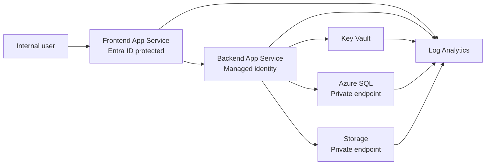
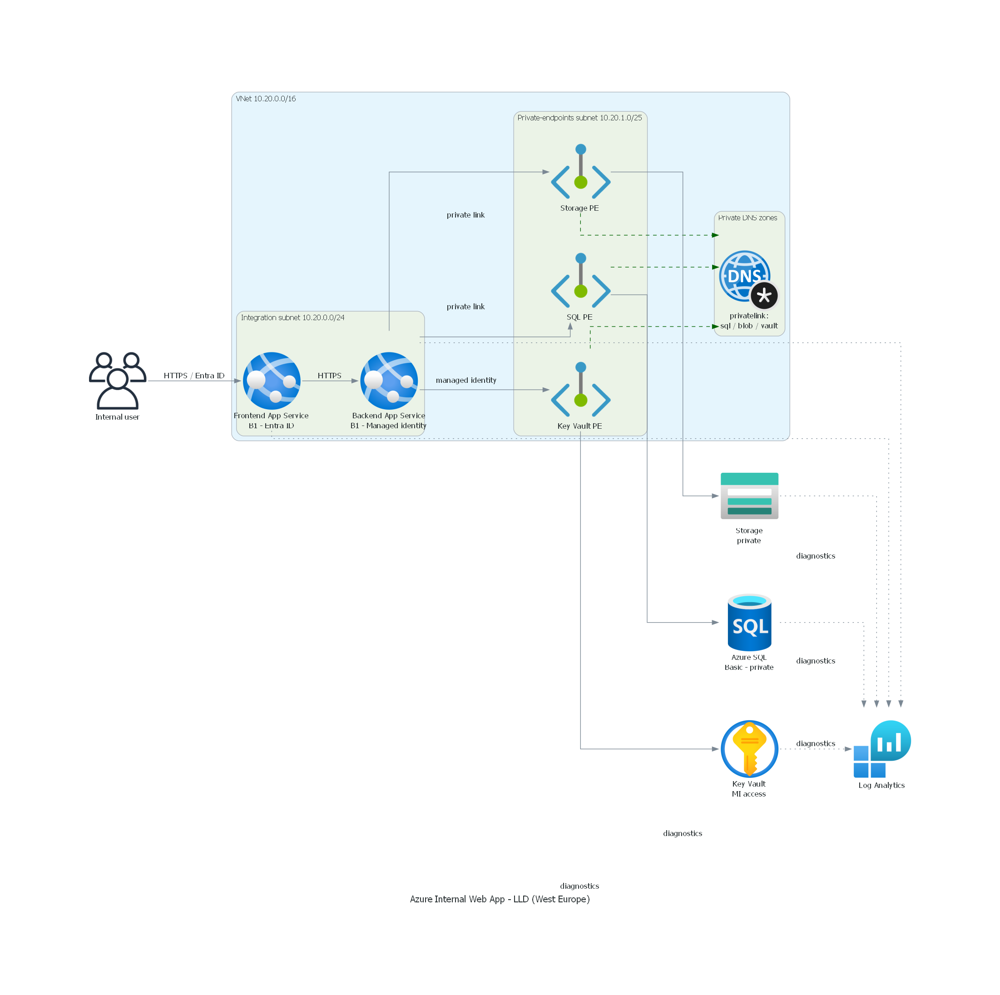

## Scope and boundary

This repository captures the approved Azure baseline as documentation and validation assets only. It does not deploy resources, perform Azure sign-in, populate secrets, assign RBAC, or mutate any subscription state.

> [!IMPORTANT]
> The current boundary stops at human review. Any Azure login, deployment, secret write, RBAC assignment, or policy exemption remains out of scope for this stage.

## Target shape

The approved shape is a single-region West Europe deployment for an internal web workload:

* Two Azure App Service B1 apps: one frontend and one backend
* Public web ingress protected by Microsoft Entra ID
* One VNet with an integration subnet and a private-endpoints subnet
* Azure SQL Database on Basic tier with private connectivity
* Azure Storage with private connectivity
* Azure Key Vault accessed through managed identity
* Log Analytics, diagnostic settings, budget alerts, and resource locks
* Policy-driven governance controls

Container hosting is not the default path. App Service is the approved baseline because it meets the cost and complexity targets more directly.

## Trust boundaries

The public edge is limited to the frontend and backend web ingress. The data plane stays private for SQL and Storage. Key Vault uses managed identity by default, with its private endpoint posture left as a policy-sensitive toggle for the later IaC and approval stage.

## Low-level design (rendered)

The icon-based low-level design below is generated with the Python `diagrams` library from the Bicep modules under `infra/bicep/modules/`. Regenerate it with `uv run --with diagrams python azure_webapp_lld.py` from [diagrams/](diagrams/).

Source generator: [diagrams/azure_webapp_lld.py](diagrams/azure_webapp_lld.py) (paired `.png` + `.svg` output).

## Network and identity decisions

| Area | Baseline |
| --- | --- |
| Region | West Europe only |
| Compute | Azure App Service B1 for frontend and backend |
| Web ingress | Public, with mandatory Entra ID protection |
| Data plane | Private endpoints for SQL and Storage |
| Key Vault | Managed identity access; private endpoint enabled only if policy requires it |
| DNS | Private DNS zones for SQL, Storage, and Key Vault |
| Operations | Diagnostics streamed to Log Analytics |
| Governance | Tags, budget alerts, locks, and Azure Policy |

## Council condition mapping

| Council condition | Handling |
| --- | --- |
| App Service over containers | Documentation: this architecture note and the ADR fix the default choice |
| West Europe only | IaC and documentation: enforce in templates later and state here now |
| Entra ID required for all users | IaC and documentation: auth settings in future templates, described here and in the access model |
| Managed identities on both apps | IaC and documentation |
| Private SQL and Storage | IaC and documentation |
| No NAT Gateway, WAF, or Application Gateway | IaC and documentation |
| Budget alerts and cost controls | IaC and documentation |
| Resource locks and required tags | IaC and documentation |
| Key Vault private endpoint only if policy requires it | Final human approval plus optional IaC toggle |
| Secret population and elevated RBAC | Final human approval after repo review |

## Reviewer checklist

Use this page to confirm the repo-only baseline before any deployment planning starts:

* The design stays within the approved West Europe scope.
* The public surface is limited to Entra ID-protected App Service ingress.
* SQL and Storage are treated as private-only services.
* Key Vault private endpoint remains an explicit policy decision, not an undocumented default.
* No repo artifact instructs the reader to sign in to Azure or deploy resources.
